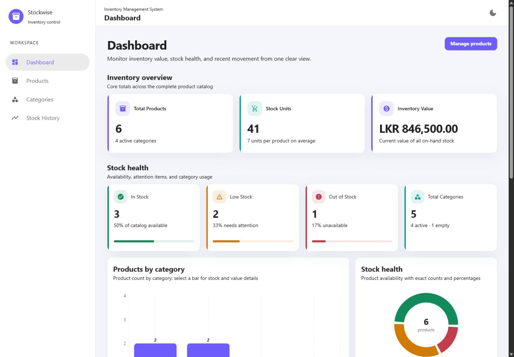
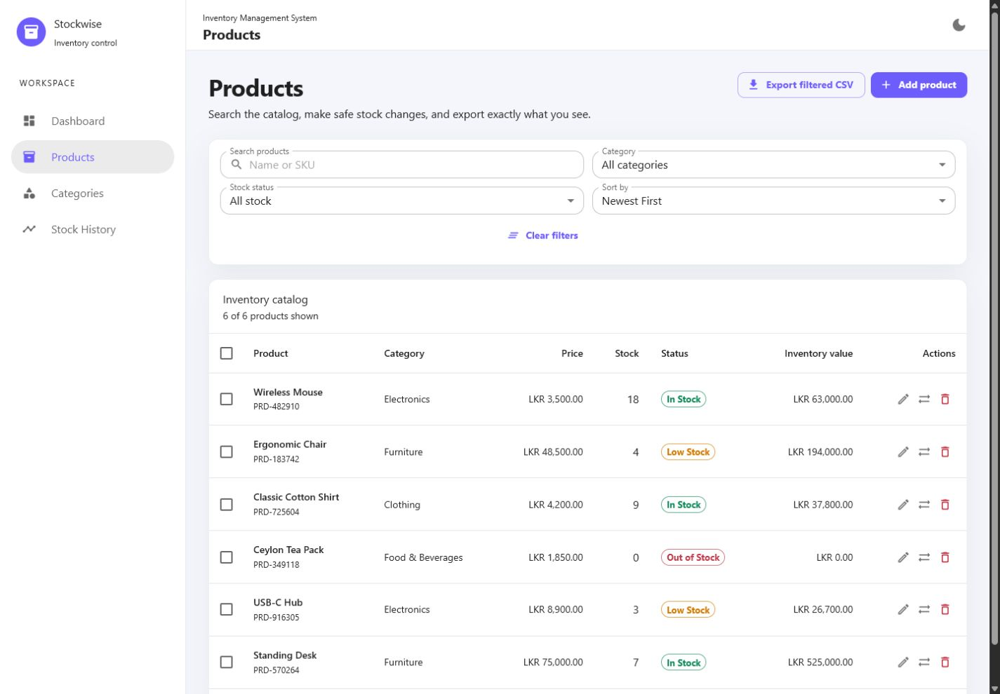
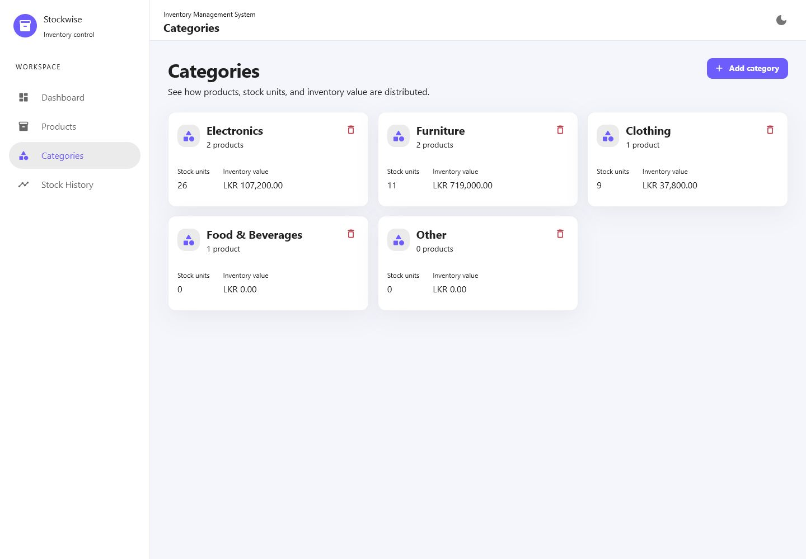
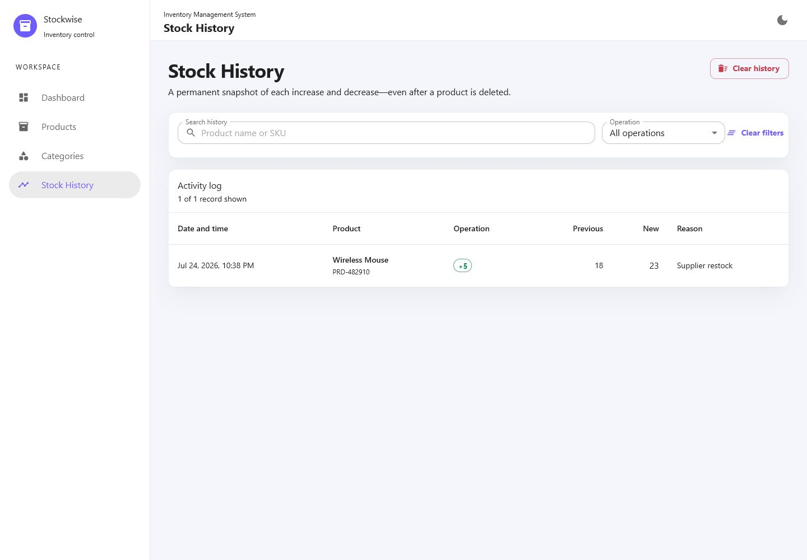
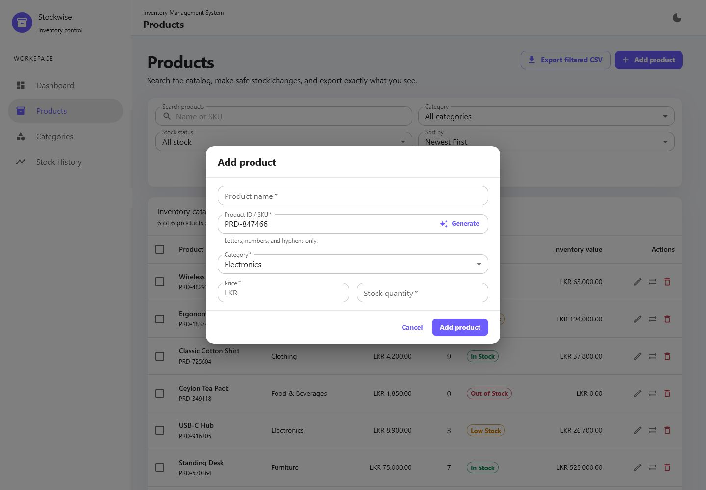
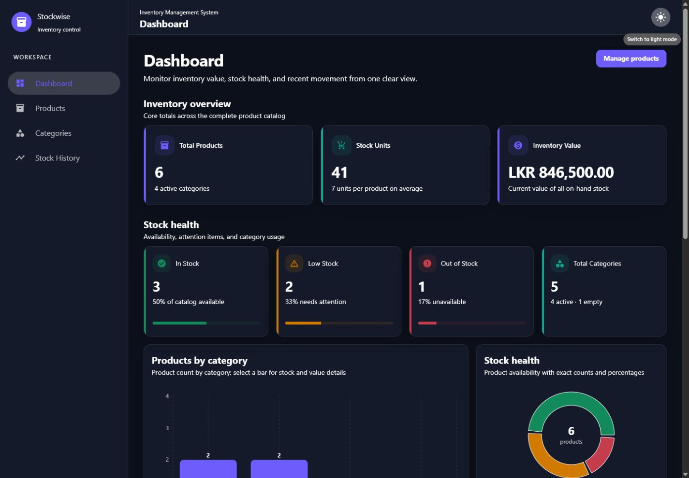
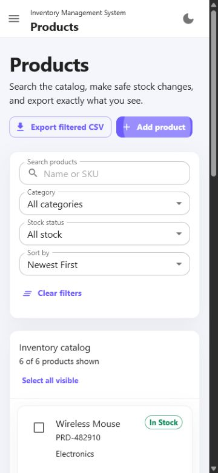

# Inventory Management System

## Project Overview

This is a frontend-only Inventory Management System created for the Software Developer Internship assignment. It can be used to manage products, categories, stock levels, and stock history from the browser.

The project does not use a backend, database, or login system. Products and other application data are saved in browser localStorage.

## Main Features

- Add, edit, and delete products
- Store product name, SKU, category, price, and stock quantity
- Prevent duplicate SKU values
- Generate a unique SKU automatically
- Increase and decrease product stock
- Prevent stock quantities from going below zero
- Record every successful stock adjustment
- Create and safely delete custom categories
- Display product count, stock units, and inventory value per category
- Search products by name or SKU
- Filter products by category and stock status
- Sort products by name, price, stock, and created date
- Display inventory totals and stock-status counts on the dashboard
- Display category and stock-status charts
- Export the filtered product list as a CSV file
- Select multiple products for bulk deletion or restocking
- Switch between light and dark themes
- Use the application on desktop, tablet, and mobile
- Keep data after refreshing or reopening the browser

## Bonus Features

The following optional assignment features are included:

- Automatically generated SKU
- Stock history log
- CSV export
- Persistent dark mode
- Analytics charts
- Bulk product actions

## Technology Stack

- React
- Vite
- JavaScript
- Material UI
- Formik
- Yup
- React Router DOM
- React Context API and useReducer
- Recharts
- React Hot Toast
- localStorage
- Vitest
- React Testing Library
- ESLint

## Project Structure

```text
src/
  components/
    categories/
    common/
    dashboard/
    history/
    products/
  context/
  hooks/
  pages/
  theme/
  utils/
  validation/
  App.jsx
  main.jsx
```

- `components` contains reusable interface components.
- `context` contains the inventory state and reducer.
- `pages` contains the main application pages.
- `validation` contains the Yup validation schemas.
- `utils` contains reusable functions for stock, CSV, currency, IDs, and localStorage.
- `theme` contains the Material UI light and dark themes.

## Installation

```bash
git clone <repository-url>
cd <project-folder>
npm install
```

Replace `<repository-url>` and `<project-folder>` with the final GitHub repository details.

## Run the Project

```bash
npm run dev
```

Open the local URL shown by Vite in the terminal.

## Available Commands

```bash
npm run dev
npm run lint
npm run test
npm run test:watch
npm run build
npm run preview
```

## Application Pages

- `/dashboard` - Inventory totals, charts, category details, and recent stock activity
- `/products` - Product management, search, filters, sorting, export, and bulk actions
- `/categories` - Category creation, usage details, and safe deletion
- `/stock-history` - Searchable and filterable stock history

Invalid routes display a Not Found page.

## localStorage

The application stores data using these separate keys:

| Key | Stored data |
| --- | --- |
| `inventory_products` | Product records |
| `inventory_categories` | Default and custom categories |
| `inventory_stock_history` | Stock adjustment records |
| `inventory_theme` | Light or dark theme |

Saved data is loaded when the application starts. Missing or corrupted JSON is handled safely so the application does not crash.

Because the data is stored in the browser, it is not shared between devices or different browser profiles. Clearing the browser site data will remove the saved inventory.

## Form Validation

All data-entry forms use Formik and Yup.

Validation includes:

- Required fields and whitespace-only input
- Product and category name length limits
- Valid SKU characters
- Case-insensitive duplicate SKU prevention
- Case-insensitive duplicate category prevention
- Existing category selection
- Positive prices with no more than two decimal places
- Non-negative whole-number stock quantities
- Positive stock-adjustment quantities
- Prevention of stock decreases below zero
- Stock-adjustment reason length

## Dashboard Calculations

- Total Products: number of products
- Total Stock Units: sum of all product quantities
- Total Inventory Value: sum of `price x quantity`
- In Stock: quantity greater than 5
- Low Stock: quantity from 1 to 5
- Out of Stock: quantity equal to 0
- Total Categories: number of available categories

## Tests

The test suite checks inventory calculations, stock status, SKU generation, validation rules, CSV generation, corrupted localStorage handling, reducer actions, and stock safety.

Run the tests with:

```bash
npm run test
```

## Production Build

```bash
npm run build
```

The production files are created in the `dist` directory.

To preview the production build:

```bash
npm run preview
```

## Screenshots

| Dashboard | Products |
| --- | --- |
|  |  |

| Categories | Stock History |
| --- | --- |
|  |  |

| Add Product Form | Dark Mode |
| --- | --- |
|  |  |

<p align="center"><strong>Mobile Products View</strong></p>
<p align="center">
  
</p>

## Deployment

The project is ready for Vercel deployment.

1. Push the project to a public GitHub repository.
2. Import the repository into Vercel.
3. Select Vite as the framework.
4. Use `npm run build` as the build command.
5. Use `dist` as the output directory.
6. Deploy the project.

The included `vercel.json` file allows React Router routes to work after deployment.

Live URL: [https://inventory-management-system-murex-rho.vercel.app](https://inventory-management-system-murex-rho.vercel.app)

## Known Limitations

- Data is stored only in the current browser.
- There is no login or multi-user support because the assignment is frontend-only.
- Clearing browser site data removes the saved inventory.
- CSV import is not included.
- Large inventories may require pagination and a backend in a production system.
